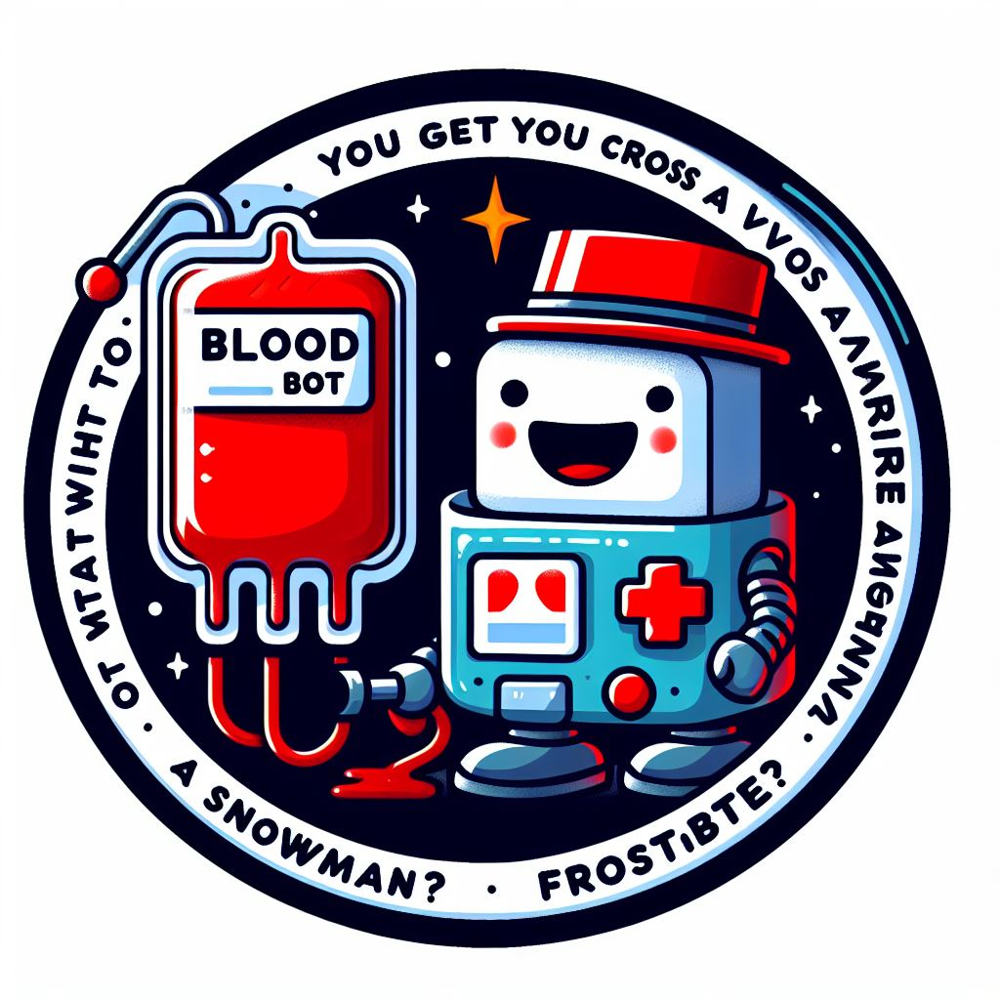

# Telegram Malaysia Blood Donations Bot

     

    <small>Image generated with AI</small>

## Introduction
This is a Telegram bot that makes visualization according to MoH Blood Donations Data. It is written in Python and uses the [python-telegram-bot](https://github.com/python-telegram-bot/python-telegram-bot) library.

## Features
- Daily Job that sends the latest up to date statistics
- Trend of Malaysia Blood Donation
- Trend of Malaysian States Blood Donation
- Retention trend of Malaysia Blood Donation
- Bot is able to answer questions regarding Blood Donation in Malaysia

## Usage
The bot is currently hosted on Digital Ocean via the Docker Container. You can find it the bot on telegram [here](https://t.me/Alif_BloodDonationMonitorBot).

Alternatively, you can host it yourself by following the instructions below.

### Installation
1. Clone this repository.
2. Install the required packages using `pip install -r requirements.txt`.
3. Modify the API token in main.py or use enviroment variables.
4. Run `python3 main.py` to start the bot.
5. The bot should be up and running now.

#### Alternative Installation
1. Clone this repository.
2. build the image `docker build -t blood_bot .`
3. run the container `docker run -it --name <insert_container_name_here> --privileged -d --restart blood_bot`
4. The bot should be up and running now.

#### Alternative Installation (DockerHub)
1. pull the image from dockerhub `docker pull englios/blood_bot:latest`
2. run the container `docker run -it --name <insert_container_name_here> --privileged -d --restart englios/blood_bot:latest`
3. The bot should be up and running now.

### Commands
- `/help` - Displays the list of commands
- `/start` - Starts me up
- `/daily` - Sends the latest up to date daily statistics
- `/daily_msg` - Shows the latest up to date daily message
- `/dail_viz` - Shows the latest up to date daily visualization
- `/schedule` - Manually Schedules Bot Daily Job
- `/schedule_stop` - Stops the Daily Job
- `/show_all` - Shows all the visualization with no summary
- `/show_malaysia` - Shows the trend of Malaysia Blood Donation
- `/show_states` - Shows the trend of Malaysian States Blood Donation
- `/show_retention` - Shows the retention trend of Malaysia Blood Donation
- `/show_new_donors` - Shows the trend of new donors in Malaysia
- `/questions` - Displays the list of questions you can ask me!
- `/info` - Shows further info of the Blood Donation Bot
- `/stop_bot` - Stops the Bot
